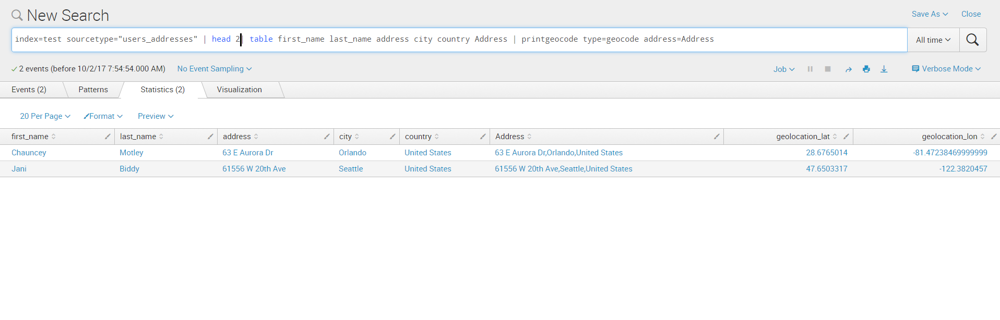
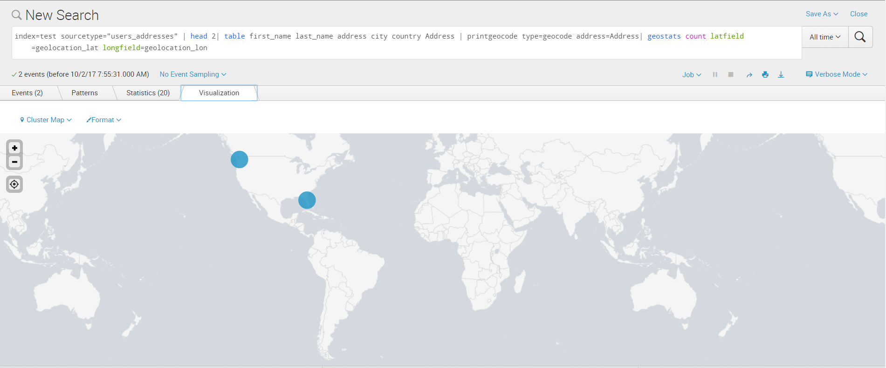
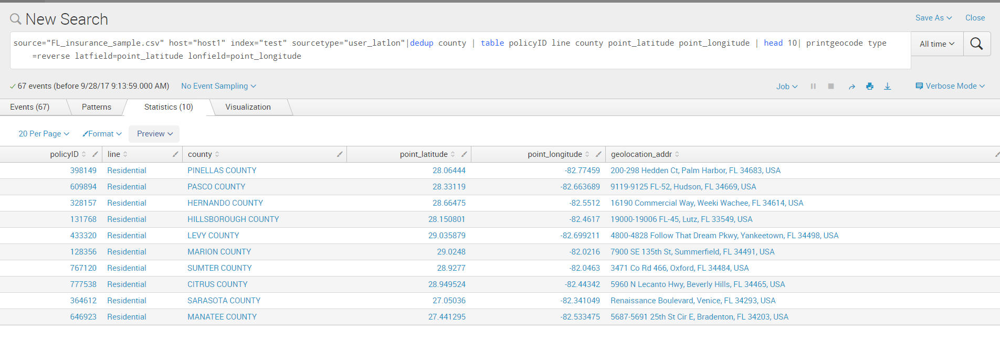

# Google GeoCode App

## Overview

Google GeoCode app is a way to translate your address fields into (latitude,longitude) and also reverse i.e. (latitude,longitude) into Address. Just use the command "printgeocode" in pipeline to your Splunk search command and convert your address to geolocation points or vice versa.

Version: 1.6

# Infrastructure Requiment

Any Operating system (tested on Windows 7/10 and Linux)
Splunk 6.4, 6.5, 6.6

# Installation

  - Install the app on your Splunk Search Head(s).
  - Get a google API key from [Google API Key](https://developers.google.com/maps/documentation/javascript/get-api-key)
  - Write the API_Key in the setup page
  - Restart Splunk Search Head.

# Usage
```sh
  <your splunk query>|printgeocode type=geocode address=<Address_field>
```
Returns three new fields: geolocation_status, geolocation_lat and geolocation_lon


  OR 
```sh  
   <your splunk query>|printgeocode type=reverse latfield=<latfieldname> lonfield=<lonfieldname>
 ```
Returns two new fields: geolocation_status and geolocation_addr
 
Where type=geocoding tells the app that it is geocoding and type=reverse indicates that it is Reverse Geocoding
Address_field is the name of the text field in your data which contains a valid address. latfieldname and lonfieldname are fields    containing values of latitude and longitudes of an geopoint respectively.

The output fields are prefixed with keyword geolocation.

   - Example-1 Geocoding: Address to latitude,longitude
   
 ```sh
index=test sourcetype="users_addresses" | head 2| table first_name last_name address city country Address | printgeocode type=geocode address=Address
```

 

- Use map with latitude,longitude from the output of the command
 ```sh
index=test sourcetype="users_addresses" | head 2| table first_name last_name address city country Address | printgeocode type=geocode address=Address| geostats count latfield=geolocation_lat longfield=geolocation_lon 
```

  


- Example-2 Reverse Geocoding: latitude,longitude to Address
 ```sh
index=test sourcetype="user_latlon" | head 5| table policyID line county point_latitude point_longitude | printgeocode type=reverse latfield=point_latitude lonfield=point_longitude 
```
 
  

As simple as looking for a location on Maps :)

### Troubleshooting

- The field geolocation_status is an indicator of the status from Google's Geolocation API. If everything is okay (input, quota of API key and Internet connection), the status will be "OK". Below are some of the status returned by Google's API-

    - "OK" indicates that no errors occurred; the address was successfully parsed and at least one geocode was returned.
    - "ZERO_RESULTS" indicates that the geocode was successful but returned no results. This may occur if the geocoder was passed a non-existent address.
    - "OVER_QUERY_LIMIT" indicates that you are over your quota.
    - "REQUEST_DENIED" indicates that your request was denied.
    - "INVALID_REQUEST" generally indicates that the query (address, components or latlng) is missing.
    - "UNKNOWN_ERROR" indicates that the request could not be processed due to a server error. The request may succeed if you try again.

- If you get an error "OVER_QUERY_LIMIT", you can try below options -

  - Option1: Get a new Key and put that value in myconfig.py. Restart Splunk search head, the results should be good.
  - Option 2: Wait for midnight PST timezone for the limit to rest :)


More information and code is avaialble here:

[Gitgub Link](https://github.com/meenalluktuke/GoogleGeoCode/blob/master/README.md)

# References
The app uses the Google's Geocoding API. Here's the link to their [documentation](https://developers.google.com/maps/documentation/geocoding/intro)

Geocoding is the process of converting addresses (like "1600 Amphitheatre Parkway, Mountain View, CA") into geographic coordinates (like latitude 37.423021 and longitude -122.083739), which you can use to place markers on a map, or position the map.
Reverse geocoding is the process of converting geographic coordinates into a human-readable address.

The Google Maps Geocoding API provides a direct way to access these services via an HTTP request. The following example uses the Geocoding service through the Google Maps JavaScript API to demonstrate the basic functionality.

# Contact Information
For any issues or questions, please reach out to: meenal.luktuke@gmail.com
We provide only Level-1 support for this application.
